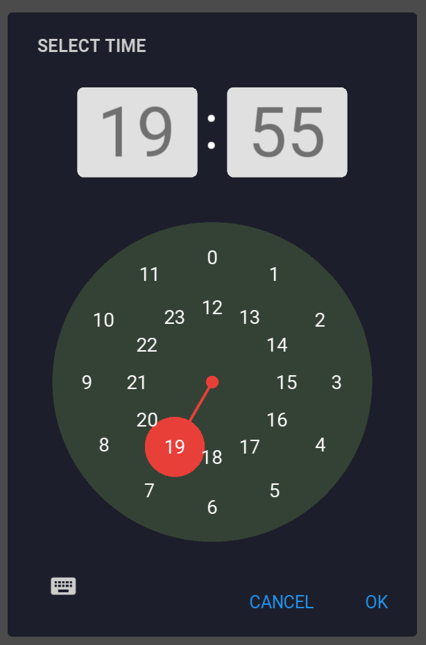

# KivyMD TimePicker with 24-hour time support

According to Wikipedia:
> The [12-hour time convention](https://en.wikipedia.org/wiki/12-hour_clock) is common in several English-speaking nations and former British colonies, as well as a few other countries. ... In most countries, however, the 24-hour clock is the standard system used, especially in writing. ... [This system](https://en.wikipedia.org/wiki/24-hour_clock), as opposed to the 12-hour clock, is the most commonly used time notation in the world today, and is used by the international standard ISO 8601.

Unfortunately, the KivyMD project removed the option of a 24-hour clock as *unnecessary,* at the same time also refering to some Material Design related reasons, which are rather unclear to me. (See [this thread](https://github.com/kivymd/KivyMD/issues/132#issuecomment-1039161258) for yourself.) To [my enquiry](https://github.com/kivymd/KivyMD/issues/132#issuecomment-1039554915) asking what happens if I implement this feature myself, I was told that they *consciously got rid of the functionality*. This is why I post this outcast feature myself instead of a pull request to the KivyMD repo. If you like this feature of a 24-hour clock or you simply want to show your support for an inclusive TimePicker that offers both options thus making everyone happy, please, consider giving this tiny repo a Star. Who knowns, if it gains enough popularity, maybe it could be part of KivyMD one day?..

Independently of this design detail, I would like to express my great appreciation to all the [Contributors](https://github.com/kivymd/KivyMD#contributors) of the [KivyMD](https://github.com/kivymd/KivyMD) project, which I find a very useful and valuable extension to Kivy!

<br>

## How to use `timepicker.py` in a desktop environment?

The current version is based on `timepicker.py` from the [KivyMD master branch as of 220223 (hash: 041c7af)](https://github.com/kivymd/KivyMD/archive/041c7af.zip). If you use this branch or something sufficiently similar, just replace `/kivymd/uix/pickers/timepicker/timepicker.py` with the file from here, then...

```py
#MDTimePicker.AMPM_or_24h="24h"   # to use the 24h clock (the default setting)
#MDTimePicker.AMPM_or_24h="AMPM"  # to use the 12h clock

time_dialog = MDTimePicker()
```

## How to make use of it with [Buildozer](https://github.com/kivy/buildozer) or [python-for-android](https://github.com/kivy/python-for-android/)?

* If you don't have it yet, create a directory in your project folder for your own recipes (e.g. `myRecipes`) and download the `kivymd` folder into it.
* You also have to amend your `buildozer.spec` file in three ways:
    * `source.exclude_dirs = ..,myRecipes` (not critical, but better so)
    * `requirements = ..,kivymd` < whatever you had here before the application of the above recipe (could be e.g. `https://github.com/kivymd/KivyMD/archive/master.zip`), now you have to refer to it be the name of your recipe: `kivymd`
    * `p4a.local_recipes = myRecipes`
* Either delete the corresponding folders, or just `buildozer android clean` to enforce the new recipe with the patch.


